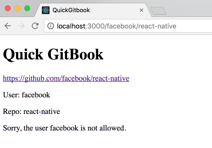
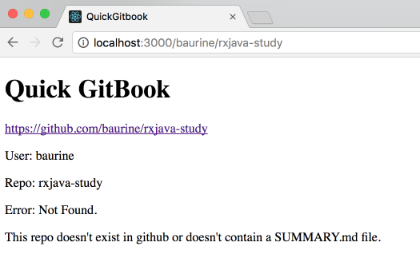
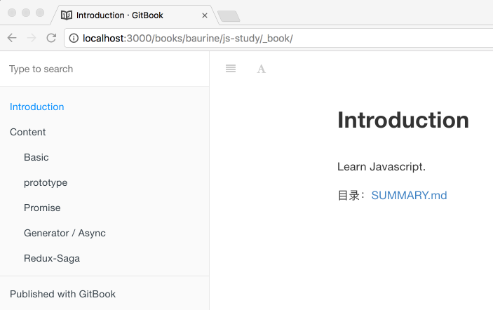
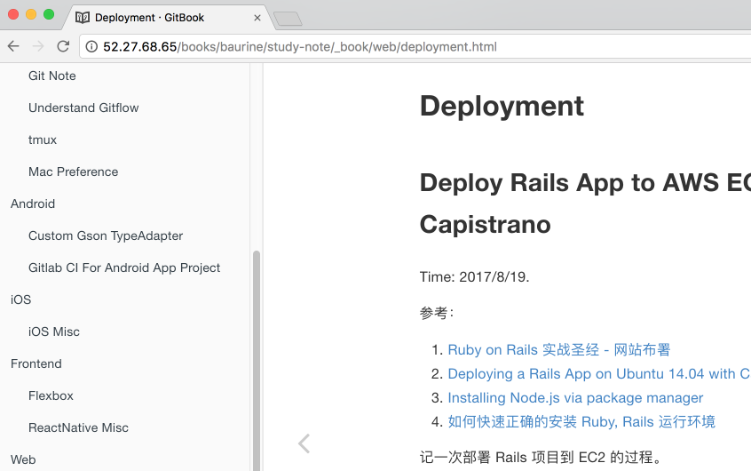

# Quick Gitbook

A web service likes [SourceGraph](https://sourcegraph.com/github.com/baurine/quick-gitbook) to quickly view your gitbook repo from github.

It is simple and direct, not powerful and robust, just works.

## How to run it

1. Git clone this repo
1. Install gitbook tool by [`npm install gitbook-cli -g`](https://github.com/GitbookIO/gitbook/blob/master/docs/setup.md)
1. Run `bundle` to install gems
1. Copy `config/users_whitelist.example.yml` to `config/users_whitelist.yml`, edit it if you want
1. Run `bin/rails s` to start the server
1. After you feel it is ok, you can deploy to yourself cloud server

## Why I do this

I put my study note in github, in different repos, and organize them as gitbook (has a SUMMARY.md for every repo). But I don't want to import them to [gitbook.com](https://www.gitbook.com/) one by one, neither want to put a `_book` folder inside the repo. I want a service likes [JitPack.io](https://jitpack.io/), [SourceGraph](https://about.sourcegraph.com/), [GitPitch](https://gitpitch.com/), you can directly append your repo link after above links then get what you want immediately.

## How it works

It is super simple. when you access `/:user/:repo`, likes `/baurine/js-study`, it will run as following steps:

1. Check whether user is allowed, because maybe you just want to view yourself gitbook repos. you can config users whitelist in `config/users_whitelist.yml`.
1. If user is allowed, check whether the repo has a **SUMMARY.md** file.
1. If has a **SUMMARY.md**, git clone or update this repo from github.
1. If the repo is just created or has new changes, rebuild it by `gitbook build`, it will generate `_book` folder under the repo foloder.
1. Redirect to `/books/:user/:repo/_book/` to view the result.

After the `_book` folder is generated, you can directly access `/books/:user/:repo/_book/` (don't forget the last slash) to avoid wait too long to check whether the repo has new changes.

Only when you update the repo to github, then you need to access the `/:user/:repo` to rebuild the gitbook.

The [main code](./app/controllers/books_controller.rb) is only about 50 lines.

Some screenshots:

1. User not allowed

   

1. Not a gitbook repo

   

1. Get what we want

   

## TODO

- [x] Deploy to a cloud server to make it really works

  

  deploy it to aws ec2, and now it is accessible public.

  [Deploy Rails App to AWS EC2 by Nginx, Puma & Capistrano](http://52.27.68.65/books/baurine/study-note/_book/web/deployment.html)

- [ ] Bind domain
- [ ] List all gitbooks in home page
- [ ] Improve static files access speed
- [ ] Link `_book` folder to a short path
- [ ] Use sidekiq to update git repos periodically
- [ ] Monit the app
